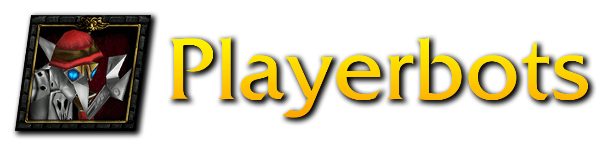

<p align="center">
    <a href="https://github.com/mod-playerbots/mod-playerbots/blob/master/README.md">English</a>
    |
    <a href="https://github.com/mod-playerbots/mod-playerbots/blob/master/README_CN.md">中文</a>
    |
    <a href="https://github.com/mod-playerbots/mod-playerbots/blob/master/README_ES.md">Español</a>
</p>


<div align="center">
  
</div>

<div align="center">
    
    
    
</div>

# Playerbots Module
`mod-playerbots` is an [AzerothCore](https://www.azerothcore.org/) module that adds player-like bots to a server. The project is based off [IKE3's Playerbots](https://github.com/ike3/mangosbot).

Features include:

- The ability to log in alt characters as bots, allowing players to interact with their other characters, form parties, level up, and more
- Random bots that wander through the world, complete quests, and otherwise behave like players, simulating the MMO experience
- Bots capable of running most raids and battlegrounds
- Highly configurable settings to define how bots behave
- Excellent performance, even when running thousands of bots

We also have a **[Discord server](https://discord.gg/NQm5QShwf9)** where you can discuss the project, ask questions, and get involved in the community!

## Installation

Supported platforms are Ubuntu, Windows, and macOS. Other Linux distributions may work, but may not receive support.

> **Important:** All `mod-playerbots` installations require a custom fork of AzerothCore: [mod-playerbots/azerothcore-wotlk (Playerbot branch)](https://github.com/mod-playerbots/azerothcore-wotlk/tree/Playerbot). The standard AzerothCore repository will **not** work.

### Quick Start

```bash
git clone https://github.com/mod-playerbots/azerothcore-wotlk.git --branch=Playerbot
cd azerothcore-wotlk/modules
git clone https://github.com/mod-playerbots/mod-playerbots.git --branch=master
```

Then build the server following the platform-specific instructions in our **[Installation Guide](https://github.com/mod-playerbots/mod-playerbots/wiki/Installation-Guide)**.

> **Testing branch:** A `test-staging` branch is available with the latest features and fixes before they are merged into `master`. To use it, clone with `--branch=test-staging` instead. Note that this branch may contain unstable or breaking changes — use it at your own risk and only if you are comfortable troubleshooting issues.

### Detailed Guides

| Guide | Description |
|---|---|
| **[Installation Guide](https://github.com/mod-playerbots/mod-playerbots/wiki/Installation-Guide)** | Full step-by-step instructions for clean installs, migrating from existing AzerothCore, Docker setup, adding modules, and updating |
| **[Troubleshooting](https://github.com/mod-playerbots/mod-playerbots/wiki/Troubleshooting)** | Solutions to the most common build errors, database issues, configuration mistakes, crashes, and platform-specific problems |

For additional references, see the [AzerothCore Installation Guide](https://www.azerothcore.org/wiki/installation) and [Installing a Module](https://www.azerothcore.org/wiki/installing-a-module) pages.

## Documentation

The [Playerbots Wiki](https://github.com/mod-playerbots/mod-playerbots/wiki) contains an extensive overview of AddOns, commands, raids with programmed bot strategies, and recommended performance configurations. Please note that documentation may be incomplete or out-of-date in some sections, and contributions are welcome.

Bots are controlled via chat commands. For larger bot groups, this can be cumbersome. Because of this, community members have developed client AddOns to allow controlling bots through the in-game UI. We recommend you check out their projects listed in the [AddOns and Submodules](https://github.com/mod-playerbots/mod-playerbots/wiki/Playerbot-Addons-and-Sub%E2%80%90Modules) page.

## Contributing

This project is still under development. We encourage anyone to make contributions, anything from pull requests to reporting issues. If you encounter any errors or experience crashes, we encourage you [report them as GitHub issues](https://github.com/mod-playerbots/mod-playerbots/issues/new?template=bug_report.md). Your valuable feedback will help us improve this project collaboratively.

If you make coding contributions, `mod-playerbots` complies with the [C++ Code Standards](https://www.azerothcore.org/wiki/cpp-code-standards) established by AzerothCore. Each Pull Request must include all test scenarios the author performed, along with their results, to demonstrate that the changes were properly verified.

We recommend joining the [Discord server](https://discord.gg/NQm5QShwf9) to make your contributions to the project easier, as a lot of active support is carried out through this server.

Please click on the "⭐" button to stay up to date and help us gain more visibility on GitHub!

## Acknowledgements

`mod-playerbots` is based on [ZhengPeiRu21/mod-playerbots](https://github.com/ZhengPeiRu21/mod-playerbots) and [celguar/mangosbot-bots](https://github.com/celguar/mangosbot-bots). We extend our gratitude to [@ZhengPeiRu21](https://github.com/ZhengPeiRu21) and [@celguar](https://github.com/celguar) for their continued efforts in maintaining the module.

Also, a thank you to the many contributors who've helped build this project:

<a href="https://github.com/mod-playerbots/mod-playerbots/graphs/contributors">
  
</a>
